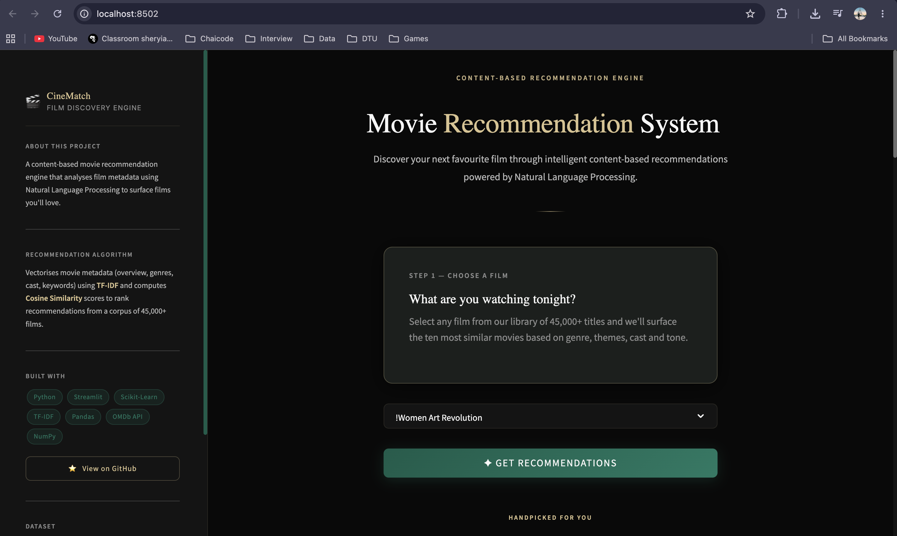

# CineMatch — Movie Recommendation System

<div align="center">



**A premium content-based film discovery engine built with NLP, TF-IDF and Streamlit.**

[](https://python.org)
[](https://streamlit.io)
[](https://scikit-learn.org)
[](LICENSE)

</div>

---

## Overview

**CineMatch** is a content-based movie recommendation system that analyses the textual metadata of 45,000+ films — including plot summaries, genres and taglines — using **TF-IDF vectorisation** and **cosine similarity** to surface the most cinematically similar titles.

Select any movie from the dropdown, click **Get Recommendations**, and receive nine curated suggestions ranked by content similarity — each card showing the poster, IMDb rating, release year, runtime, genre pills and a short plot summary.

---

## Screenshots

### Hero & Search


*Cinematic hero section with elegant selector card, Dark Emerald theme, and Champagne Gold accents.*

### Recommendation Grid


*Rich movie cards in a spacious 3-column grid — poster, IMDb badge, metadata and genre pills per card.*

---

## How It Works

This is a **content-based filtering** system. Recommendations are derived from the textual similarity of film metadata, not user ratings or collaborative signals.

### Pipeline

```
movies_metadata.csv
        │
        ▼
  Data Cleaning & EDA
  (drop duplicates, handle nulls)
        │
        ▼
  Feature Engineering
  tags = overview + genres + tagline
        │
        ▼
  NLP Preprocessing
  (lowercase → remove punctuation →
   stopword removal → lemmatization)
        │
        ▼
  TF-IDF Vectorization
  (50,000 features, unigrams + bigrams)
        │
        ▼
  Serialize Artifacts → .pkl files
        │
        ▼
  Streamlit App (main.py)
  loads pickles → cosine similarity
  at query time → returns top 9
```

### RAM-Safe Similarity

Instead of pre-computing the full 45K × 45K cosine similarity matrix (~8 GB RAM), similarity is computed **on demand** for the queried movie only:

```python
sim_scores = linear_kernel(tfidf_matrix[idx], tfidf_matrix).flatten()
```

This keeps memory usage minimal regardless of dataset size.

---

## Tech Stack

| Library | Version | Purpose |
|---|---|---|
| `streamlit` | 1.58.0 | Interactive web UI |
| `scikit-learn` | 1.9.0 | TF-IDF vectorizer + cosine similarity |
| `pandas` | 3.0.3 | Data loading & manipulation |
| `numpy` | 2.5.0 | Array operations |
| `requests` | latest | OMDb API calls for posters & metadata |
| `nltk` | latest | Stopword removal & lemmatization (notebook) |
| `uv` | latest | Fast Python package manager |

- **Python**: 3.13
- **Package Manager**: [`uv`](https://github.com/astral-sh/uv)
- **External API**: [OMDb API](https://www.omdbapi.com/) — poster images, IMDb ratings, runtime

---

## Project Structure

```
Movie-recommendation/
│
├── main.py                  # Streamlit app — UI layer + recommendation logic
├── omdb.py                  # OMDb API integration with Streamlit caching
├── style.py                 # All CSS, sidebar HTML and card renderer (NEW)
│
├── notebook.ipynb           # Full EDA, preprocessing & model training
│
├── movies_df.pkl            # Cleaned & processed DataFrame (~29 MB)
├── tfidf_matrix.pkl         # Sparse TF-IDF feature matrix (~19 MB)
├── tfidf_vectorizer.pkl     # Fitted TfidfVectorizer object (~2 MB)
├── indices.pkl              # Title → DataFrame index mapping (~1.4 MB)
│
├── movies_metadata.csv      # Raw dataset (45,466 movies, 24 columns)
│
├── screenshots/             # App screenshots for README
│   ├── image.png            # Hero & selector view
│   └── image copy.png       # Recommendation grid view
│
├── assets/
│   └── images.png           # Placeholder poster for unavailable images
│
├── .streamlit/
│   ├── config.toml          # Dark theme configuration
│   └── secrets.toml         # OMDb API key (not tracked in git)
│
├── pyproject.toml           # Project metadata & dependencies (uv)
├── requirements.txt         # Pinned dependency list
├── .python-version          # Python 3.13
├── .gitignore
├── LICENSE
└── README.md
```

> 💡 Pre-built `.pkl` model artifacts are included so you can run the app immediately without re-training. To retrain from scratch, run all cells in `notebook.ipynb`.

---

## Getting Started

### Prerequisites

- Python 3.13+
- [`uv`](https://github.com/astral-sh/uv) (recommended) **or** `pip`
- A free [OMDb API key](https://www.omdbapi.com/apikey.aspx)

### 1. Clone the repository

```bash
git clone https://github.com/Ansh0330/Movie-recommendation.git
cd Movie-recommendation
```

### 2. Add your OMDb API key

Create the secrets file:

```bash
mkdir -p .streamlit
echo 'OMDB_API_KEY = "your_key_here"' > .streamlit/secrets.toml
```

### 3. Install dependencies

**With `uv` (recommended):**
```bash
uv sync
source .venv/bin/activate   # macOS / Linux
# .venv\Scripts\activate    # Windows
```

**With `pip`:**
```bash
pip install -r requirements.txt
```

### 4. Launch the app

```bash
streamlit run main.py
```

Open `http://localhost:8501` in your browser.

> ✅ No dataset download or re-training needed — the pre-built model files are included.

---

## Dataset

**Source:** [The Movies Dataset — Kaggle](https://www.kaggle.com/datasets/rounakbanik/the-movies-dataset)

| Property | Value |
|---|---|
| File | `movies_metadata.csv` |
| Raw rows | 45,466 movies |
| Columns | 24 (title, overview, genres, tagline, budget, revenue, etc.) |
| After cleaning | 45,447 rows |

**Features used for recommendations:**

| Column | Description |
|---|---|
| `overview` | Plot summary |
| `genres` | Genre labels (e.g., `Animation Comedy Family`) |
| `tagline` | Marketing tagline |

---

## Model Details

### Text Preprocessing

A `tags` column is created by concatenating `overview`, `genres`, and `tagline` per movie, then preprocessed with NLTK:

```python
text = text.lower()
text = re.sub(r'[^a-z\s]', ' ', text)                    # remove punctuation & numbers
words = [w for w in text.split() if w not in stop_words]  # remove stopwords
words = [lemmatizer.lemmatize(w) for w in words]          # lemmatize to root form
```

### TF-IDF Vectorizer

```python
TfidfVectorizer(
    max_features=50000,   # vocabulary cap
    ngram_range=(1, 2),   # unigrams + bigrams
    stop_words='english'  # additional English stopword filter
)
# Output shape: (45,447 movies × 50,000 features)
```

### UI Architecture

The app separates concerns into three files:

| File | Responsibility |
|---|---|
| `main.py` | Data loading, recommendation logic, Streamlit layout |
| `omdb.py` | Cached OMDb API calls — returns poster, rating, runtime, genre, plot |
| `style.py` | All CSS design tokens, sidebar HTML and movie card HTML renderer |

---

## Design System

The UI uses a custom **Dark Emerald Luxury** theme — inspired by premium editorial design, not the default Streamlit aesthetic.

| Token | Value | Usage |
|---|---|---|
| Background | `#090909` | App body |
| Card | `#1B1F1D` | Movie cards & selector |
| Deep Emerald | `#0F5C4A` | Button gradient start |
| Forest Emerald | `#157A63` | Button gradient end, pills |
| Champagne Gold | `#D8C28F` | Eyebrows, rating badge, logo |
| Primary Text | `#F7F7F7` | Headings |
| Muted Text | `#8D8D8D` | Captions, labels |

---

## Contributing

Contributions are welcome! Some ideas:

- [ ] Incorporate cast/crew data for richer recommendations
- [ ] Add a hybrid model combining TF-IDF with collaborative filtering
- [ ] Deploy to Streamlit Cloud / Hugging Face Spaces
- [ ] Add a watchlist / favourites feature

---

## License

This project is open-source and available under the [MIT License](LICENSE).

---

<div align="center">
<em>Crafted with ♥ using Python, scikit-learn, and Streamlit</em>
</div>
